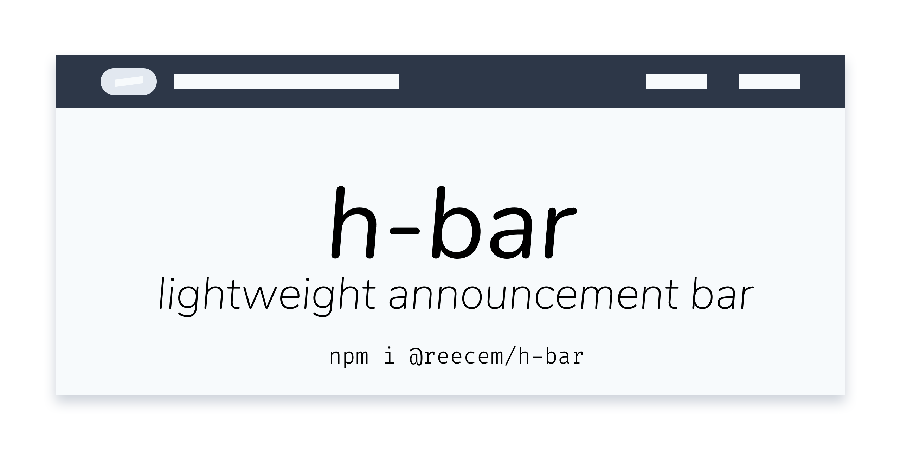

# h-bar lightweight announcement bar

An Announcement Banner that is lightweight and customizable

[](https://www.npmjs.com/package/@reecem/h-bar)
[](https://www.npmjs.com/package/@reecem/h-bar)

[](https://www.jsdelivr.com/package/npm/@reecem/h-bar)

<h1 align="center">
<br>
  
  <br>
    <br>
    h-bar Announcement banner
  <br>
</h1>

The announcement bar uses native methods to make the library lightweight so that it can be loaded quickly, bar the webpack stuff.

**Note**
The initial version makes use of the WordPress API to be able to get the latest post.

i.e. it expects a json structure like so:
From a url like `http://blog.example.com/wp-json/wp/v2/posts?per_page=1&_fields=id,title,link`
```json
[
    {
        "id": 175,
        "link": "https:\/\/blog.example.com\/how-to-hunt-a-vole\/",
        "title": {
            "rendered": "How To Hunt A Vole"
        }
    }
]
```

I plan to add more options and a parser callback that can be defined to extract a standard format.

## Installation

You can install the package via npm:

```bash
npm i @reecem/h-bar
```

Or use jsDelivr:
```html
    ...
    <script src"https://cdn.jsdelivr.net/npm/@reecem/h-bar@latest/dist/hBar.min.js"></script>
    ...
```

> If you are customising the styling and overriding it with your own styling then you will also need an instance of your css or a tailwindcss file installed as only the classes needed are packaged with h-bar

## Example page

You can view an [example page](https://reecem.github.io/h-bar/example.html)

## Usage

You can import it directly into your javascript app or use it in the html.

```html
<script src="../hBar.js"></script>
<!-- or -->
<script src"https://cdn.jsdelivr.net/npm/@reecem/h-bar@latest/dist/hBar.min.js" defer></script>
<script>
    hBar.init({
        url: "http://blog.example.com/wp-json/wp/v2/posts?per_page=1&_fields=id,excerpt,title,link",
        secondaryLinks: [
            {
                title: "Docs",
                link: "http:://docs.example.com"
            },
            {
                title: "Support",
                link: "http://help.example.com"
            }
        ],
        options: {
            theme: "blue",
        }
    });

    hBar.fetchData()
</script>
```

The initialization object currently has this structure and defaults:

```javascript
{
    url: "https://your.blog/api/....",
    onCompleted: "callback function",
    link: "The link url, can be force and no need to fetch from API",
    title: "The link url, can be force and no need to fetch from API",
    secondaryLinks: [
        {
            title: "Docs",
            link: "http:://docs.example.com"
        }
    ],
    parser: (data) => {/** Parser function */}
    dismissible: false, // dismissible banner flag
    dismissFor: new Date('2020-03-30'), // would dismiss it till end of March 30th 2020
    theme: "gray",
    headers: {
        "Authorization": "Bearer {TOKEN}"
    },
    customStyles: {
        wrapper: "hb-flex hb-w-full hd-flex-col md:hb-flex-row sm:hb-flex-row hb-text-sm hb-py-2 md:hb-px-20 hb-px-1 hb-items-center hb-justify-between",
        linkWrapper: "hb-flex hb-items-center",
        badge: "hb-px-2 hb-mx-2 hb-leading-relaxed hb-tracking-wider hb-uppercase hb-font-semibold hb-rounded-full hb-text-xs",
        postTitle: "hover:hb-underline",
        secondaryLink: "hb-mx-5 hb-cursor-pointer hover:hb-underline",
    }
}
```

### Parser function

There is the availability of adding a custom parser function to override any of the default ones provided by the package.

This is handy if you have a custom endpoint that say would return also the secondary links or has a different data structure.

The parser function should always return an object with the structure:
```javascript
{
    title: String,
    link: String,
    /** the secondaryLinks is optional.
     * It will also override the links parsed in the init() arguments.
     */
    secondaryLinks: [
        {
            title: String,
            link: String,
        },
    ]
}
```

You can define the function inside the `init()` method as follows:
```javascript

hBar.init({
    url: "https://api.github.com/repos/ReeceM/h-bar/releases",
    parser: (data) => {
        // getting the first release on the list of releases from github.
        const {name, html_url} = data[0];

        return {
            title: `Lateset version available ${name}`,
            link: html_url
        };
    }
})
```

### Dismissing Notifications

> Available from `v0.3.0`/`v1.0.0`

**Temporary Dismissing**
To be able to dismiss a notification, please note it currently removes secondary links. It is therefore useful that you use this feature when just making announcements of a event or brief notification.

The way to activate session based dismissal is:

```javascript
{
    //... rest of config
    dismissible: true,
    //... rest of config
}
```

This will just disable the banner for the current page visit, if the user reloads, its back.

**Time based dismissing**

To dismiss the banner until another time, you can set the `dismissFor` variable, this requires a `Date()` object.

When you set this and the banner is dismissed, the UTC milliseconds are stored in the localStorage, this is then read back when loading h-Bar.

```javascript
{
    //... rest of config
    dismissible: true,
    dismissFor: new Date('2020-03-30'), // would dismiss it till end of march 30th
}
```

If you fail to set the value properly, it won't dismiss and the banner will show by default.


## Testing

_to come_ please make a PR if you know how to do it on JS.

## Changelog

Please see [CHANGELOG](https://github.com/ReeceM/h-bar/blob/master/CHANGELOG.md) for more information on what has changed recently.

## Contributing

Please see [CONTRIBUTING](https://github.com/ReeceM/h-bar/blob/master/CONTRIBUTING.md) for details.

## Security

[SECURITY](https://github.com/ReeceM/h-bar/security/policy)

If you discover any security related issues, please email zsh.rce@gmail.com instead of using the issue tracker.

## Credits

- [ReeceM](https://github.com/ReeceM)
- [All Contributors](../../contributors)

## Support

<a href="https://www.buymeacoffee.com/ReeceM" target="_blank"></a>

[](https://ko-fi.com/S6S7UQ66)

## License

The MIT License (MIT). Please see [License File](https://github.com/ReeceM/h-bar/blob/master/LICENSE.md) for more information.
